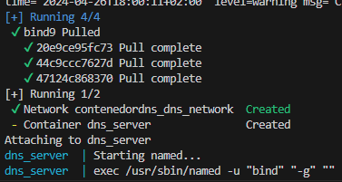
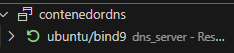

## 1. En visual studio creamos un archivo .yml llamado docker-compose.

## 2. Configuramos el docker-compose.yml para crear el contenedor.

## 3. Creamos el contenedor bind9

Utilizamos el siguiente comando para crear el contenedor:

        docker-compose up

Este comando utilizará la configuración del docker compose para crear el contenedor.

El contenedor ya estará listo.

## Descripción de las opciones del docker-compose.yml

- **image**: Especifica la imagen de Docker a utilizar, en este caso, `bind:9`.

- **container_name**: Define el nombre del contenedor como `dns_server`.

- **restart**: Configura la política de reinicio del contenedor como `always`, lo que significa que Docker intentará reiniciar automáticamente el contenedor si se detiene.

- **volumes**: Monta dos volúmenes para persistir los datos del servidor DNS. El volumen `./config` se mapea al directorio `/etc/bind` dentro del contenedor para almacenar la configuración, y el volumen `./data` se mapea a `/var/cache/bind` para almacenar los datos.

- **ports**: Expone los puertos TCP y UDP 53 del contenedor para permitir la comunicación DNS.

- **networks**: Define una red personalizada llamada `dns_network` para conectar el contenedor.